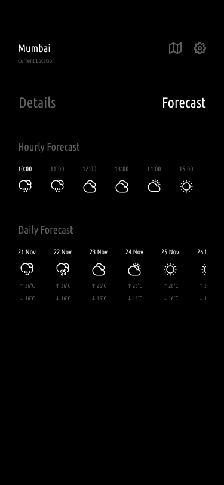

# Weather App

[](https://android-arsenal.com/api?level=21)
[](https://kotlinlang.org)
[](https://en.wikipedia.org/wiki/MIT_License)

Weatherapp is a simple weather forecast app, which uses some APIs to fetch 5 day / 3 hour forecast data from the [OpenWeatherMap](https://openweathermap.org/forecast5) and to fetch places, cities, counties, coords etc. The main goal of this app is to be a simple designed (monotonic tone) of how to build an high quality Android application that uses the Architecture components, in Kotlin.

## Screenshots 
<p>
</p>

<p>

&nbsp; &nbsp;


&nbsp; &nbsp;

</p>

<p>
</p>

<p>
</p>


## Tech Stack & Open-source libraries 
* Minimum SDK level 21.
* [Kotlin](https://kotlinlang.org/) - official programming language for Android development.
* [Coroutines](https://kotlinlang.org/docs/reference/coroutines-overview.html) - for asynchronous programming.
* [Retrofit](https://square.github.io/retrofit/) - Retrofit is type-safe REST client for Android and Java which aims to make it easier to consume RESTful web services.
* [Android Architecture Components](https://developer.android.com/topic/libraries/architecture) - collection of libraries that help you design robust, testable, and maintainable apps.
  - [LiveData](https://developer.android.com/topic/libraries/architecture/livedata) - data objects that notify views when the underlying database changes.
  - [Data Binding](https://developer.android.com/topic/libraries/data-binding) - data objects to bind UI components in your layouts to data sources in your app.
  - [ViewModel](https://developer.android.com/topic/libraries/architecture/viewmodel) - stores UI-related data that isn't destroyed on UI changes. 
  - [Room](https://developer.android.com/topic/libraries/architecture/room) - access your app's SQLite database with in-app objects and compile-time checks.
  - [Lifecycle](https://developer.android.com/topic/libraries/architecture/lifecycle) - components to perform actions in response to a change in the lifecycle status of another component, such as activities and fragments.
* [Navigation](https://developer.android.com/guide/navigation) - interactions that allow users to navigate across, into, and back out from the different pieces of content within your app.
* [Fragment](https://developer.android.com/guide/components/fragments) - represents a behavior or a portion of user interface in a FragmentActivity.
* [RecyclerView](https://developer.android.com/guide/topics/ui/layout/recyclerview) - for display a scrolling list of elements based on large data sets.
* [Shared Preferences](https://developer.android.com/training/data-storage/shared-preferences) - A SharedPreferences object points to a file containing key-value pairs and provides simple methods to read and write them.
* [Material-Components](https://github.com/material-components/material-components-android) - Material design components.
  - [Material Dialogs](https://github.com/afollestad/material-dialogs) - library with extensible dialogs API for Kotlin & Android.

## Architecture
The app uses MVVM [Model-View-ViewModel] architecture to have a unidirectional flow of data, separation of concern, testability, and a lot more.


## Contributing
Awesome! If you would like to contribute you're always welcome!

### Steps :
1.Fork it

2.Create your feature branch (git checkout -b my-new-feature)

3.Commit your changes (git commit -m 'Add some feature')

4.Push your branch (git push origin my-new-feature)

5-Create a new Pull Request    

# License
```xml
Copyright (c) 2022 Sahil Kumar

Permission is hereby granted, free of charge, to any person obtaining a copy
of this software and associated documentation files (the "Software"), to deal
in the Software without restriction, including without limitation the rights
to use, copy, modify, merge, publish, distribute, sublicense, and/or sell
copies of the Software, and to permit persons to whom the Software is
furnished to do so, subject to the following conditions:

The above copyright notice and this permission notice shall be included in all
copies or substantial portions of the Software.

THE SOFTWARE IS PROVIDED "AS IS", WITHOUT WARRANTY OF ANY KIND, EXPRESS OR
IMPLIED, INCLUDING BUT NOT LIMITED TO THE WARRANTIES OF MERCHANTABILITY,
FITNESS FOR A PARTICULAR PURPOSE AND NONINFRINGEMENT. IN NO EVENT SHALL THE
AUTHORS OR COPYRIGHT HOLDERS BE LIABLE FOR ANY CLAIM, DAMAGES OR OTHER
LIABILITY, WHETHER IN AN ACTION OF CONTRACT, TORT OR OTHERWISE, ARISING FROM,
OUT OF OR IN CONNECTION WITH THE SOFTWARE OR THE USE OR OTHER DEALINGS IN THE
SOFTWARE.
```
